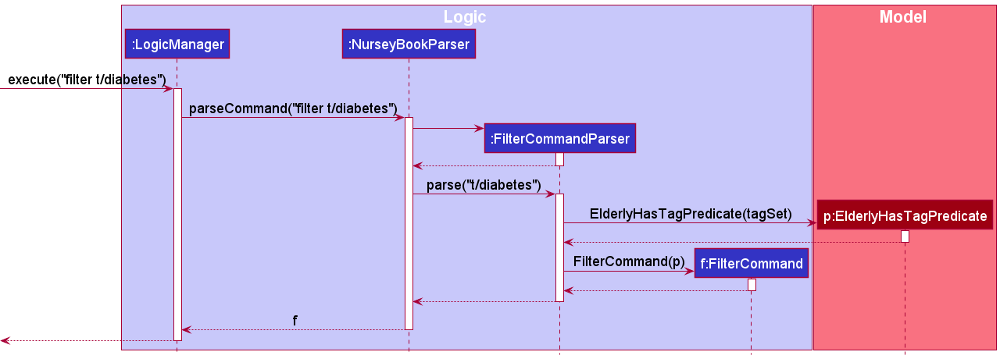
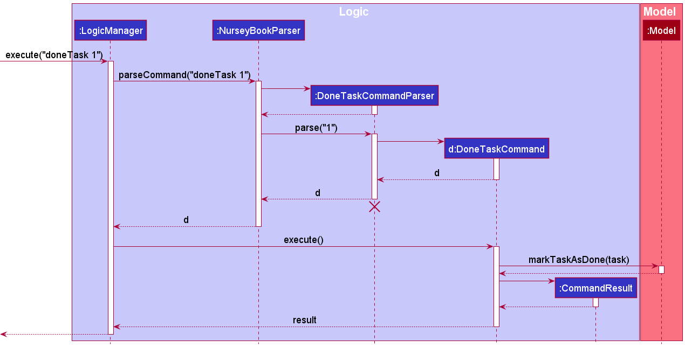
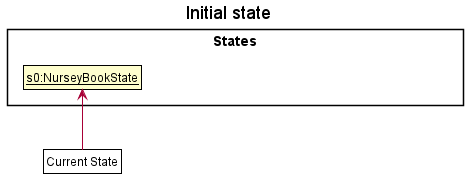
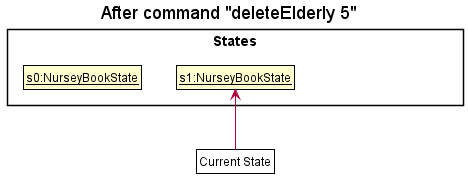
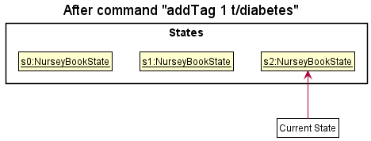
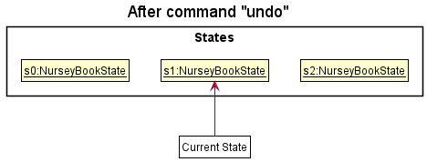
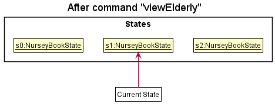
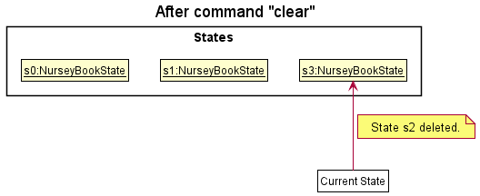

* Table of Contents
{:toc}

--------------------------------------------------------------------------------------------------------------------

## **Acknowledgements**

* {list here sources of all reused/adapted ideas, code, documentation, and third-party libraries -- include links to the original source as well}

--------------------------------------------------------------------------------------------------------------------

## **Setting up, getting started**

Refer to the guide [_Setting up and getting started_](SettingUp.md).

--------------------------------------------------------------------------------------------------------------------

## **Design**

<div markdown="span" class="alert alert-primary">

:bulb: **Tip:** The `.puml` files used to create diagrams in this document can be found in the [diagrams](https://github.com/se-edu/addressbook-level3/tree/master/docs/diagrams/) folder. Refer to the [_PlantUML Tutorial_ at se-edu/guides](https://se-education.org/guides/tutorials/plantUml.html) to learn how to create and edit diagrams.
</div>

### Architecture


The ***Architecture Diagram*** given above explains the high-level design of the App.

Given below is a quick overview of main components and how they interact with each other.

**Main components of the architecture**

**`Main`** has two classes called [`Main`](https://github.com/se-edu/addressbook-level3/tree/master/src/main/java/seedu/address/Main.java) and [`MainApp`](https://github.com/se-edu/addressbook-level3/tree/master/src/main/java/seedu/address/MainApp.java). It is responsible for,
* At app launch: Initializes the components in the correct sequence, and connects them up with each other.
* At shut down: Shuts down the components and invokes cleanup methods where necessary.

[**`Commons`**](#common-classes) represents a collection of classes used by multiple other components.

The rest of the App consists of four components.

* [**`UI`**](#ui-component): The UI of the App.
* [**`Logic`**](#logic-component): The command executor.
* [**`Model`**](#model-component): Holds the data of the App in memory.
* [**`Storage`**](#storage-component): Reads data from, and writes data to, the hard disk.


**How the architecture components interact with each other**

The *Sequence Diagram* below shows how the components interact with each other for the scenario where the user issues the command `deleteElderly 1`.


Each of the four main components (also shown in the diagram above),

* defines its *API* in an `interface` with the same name as the Component.
* implements its functionality using a concrete `{Component Name}Manager` class (which follows the corresponding API `interface` mentioned in the previous point.

For example, the `Logic` component defines its API in the `Logic.java` interface and implements its functionality using the `LogicManager.java` class which follows the `Logic` interface. Other components interact with a given component through its interface rather than the concrete class (reason: to prevent outside component's being coupled to the implementation of a component), as illustrated in the (partial) class diagram below.


The sections below give more details of each component.

### UI component

The **API** of this component is specified in [`Ui.java`](https://github.com/se-edu/addressbook-level3/tree/master/src/main/java/seedu/address/ui/Ui.java)


The UI consists of a `MainWindow` that is made up of parts e.g.`CommandBox`, `ResultDisplay`, `ElderlyListPanel`, `StatusBarFooter` etc. All these, including the `MainWindow`, inherit from the abstract `UiPart` class which captures the commonalities between classes that represent parts of the visible GUI.

The `UI` component uses the JavaFx UI framework. The layout of these UI parts are defined in matching `.fxml` files that are in the `src/main/resources/view` folder. For example, the layout of the [`MainWindow`](https://github.com/se-edu/addressbook-level3/tree/master/src/main/java/seedu/address/ui/MainWindow.java) is specified in [`MainWindow.fxml`](https://github.com/se-edu/addressbook-level3/tree/master/src/main/resources/view/MainWindow.fxml)

The `UI` component,

* executes user commands using the `Logic` component.
* listens for changes to `Model` data so that the UI can be updated with the modified data.
* keeps a reference to the `Logic` component, because the `UI` relies on the `Logic` to execute commands.
* depends on some classes in the `Model` component, as it displays `Elderly` object residing in the `Model`.

### Logic component

**API** : [`Logic.java`](https://github.com/se-edu/addressbook-level3/tree/master/src/main/java/seedu/address/logic/Logic.java)

Here's a (partial) class diagram of the `Logic` component:


How the `Logic` component works:
1. When `Logic` is called upon to execute a command, it uses the `AddressBookParser` class to parse the user command.
1. This results in a `Command` object (more precisely, an object of one of its subclasses e.g., `AddCommand`) which is executed by the `LogicManager`.
1. The command can communicate with the `Model` when it is executed (e.g. to add a elderly).
1. The result of the command execution is encapsulated as a `CommandResult` object which is returned back from `Logic`.

The Sequence Diagram below illustrates the interactions within the `Logic` component for the `execute("deleteElderly 1")` API call.


<div markdown="span" class="alert alert-info">:information_source: **Note:** The lifeline for `DeleteCommandParser` should end at the destroy marker (X) but due to a limitation of PlantUML, the lifeline reaches the end of diagram.
</div>

Here are the other classes in `Logic` (omitted from the class diagram above) that are used for parsing a user command:


How the parsing works:
* When called upon to parse a user command, the `AddressBookParser` class creates an `XYZCommandParser` (`XYZ` is a placeholder for the specific command name e.g., `AddCommandParser`) which uses the other classes shown above to parse the user command and create a `XYZCommand` object (e.g., `AddCommand`) which the `AddressBookParser` returns back as a `Command` object.
* All `XYZCommandParser` classes (e.g., `AddCommandParser`, `DeleteCommandParser`, ...) inherit from the `Parser` interface so that they can be treated similarly where possible e.g, during testing.

### Model component
**API** : [`Model.java`](https://github.com/se-edu/addressbook-level3/tree/master/src/main/java/seedu/address/model/Model.java)


The `Model` component,

* stores the address book data i.e., all `Elderly` objects (which are contained in a `UniqueElderlyList` object).
* implicitly also stores `Nok` objects which is contained in `Elderly` objects
* stores the currently 'selected' `Elderly` objects (e.g., results of a search query) as a separate _filtered_ list which is exposed to outsiders as an unmodifiable `ObservableList<Elderly>` that can be 'observed' e.g. the UI can be bound to this list so that the UI automatically updates when the data in the list change.
* stores the currently 'selected' `Task` objects in a similar way to `Elderly` objects
which is also exposed to outsiders as an unmodifiable `ObservableList<Task>`.
* stores a `UserPref` object that represents the user’s preferences. This is exposed to the outside as a `ReadOnlyUserPref` objects.
* does not depend on any of the other three components (as the `Model` represents data entities of the domain, they should make sense on their own without depending on other components)


More details regarding `Person`, `Elderly`, `Nok` and `Task` objects.


<div markdown="span" class="alert alert-info">

:information_source: **Note:** An alternative (arguably, a more OOP) model is given below. It has a `Tag` list in the `AddressBook`, which `Elderly` references. This allows `AddressBook` to only require one `Tag` object per unique tag, instead of each `Elderly` needing their own `Tag` objects.<br>


</div>


### Storage component

**API** : [`Storage.java`](https://github.com/se-edu/addressbook-level3/tree/master/src/main/java/seedu/address/storage/Storage.java)


The `Storage` component,
* can save both NurseyBook data and user preference data in json format, and read them back into corresponding objects.
* inherits from both `NurseyBookStorage` and `UserPrefStorage`, which means it can be treated as either one (if only the functionality of only one is needed).
* depends on some classes in the `Model` component (because the `Storage` component's job is to save/retrieve objects that belong to the `Model`)

### Common classes

Classes used by multiple components are in the `seedu.addressbook.commons` package.

--------------------------------------------------------------------------------------------------------------------

## **Implementation**

This section describes some noteworthy details on how certain features are implemented.

### Filter command

#### Implementation
The implementation of the filter command is facilitated by the FilterCommand class and ElderlyHasTagPredicate class.
ElderlyHasTagPredicate contains a set of tags that was queried in the filter command and has a method `test`
to test whether an Elderly has all the tags in the set.

Given below is the class diagram of the FilterCommand and the ElderlyHasTagPredicate.


The following sequence diagram shows how the filter command works:


<div markdown="span" class="alert alert-info">:information_source: **Note:** The lifeline for `FilterCommand` and `ElderlyHasTagPredicate` should end at the destroy marker (X) but due to a limitation of PlantUML, the lifeline reaches the end of diagram.

</div>

As tags can only be alphanumeric, the `parse` method in FilterCommandParser checks that the all the tags queried are valid first before creating the FilterCommand and ElderlyHasTagPredicate objects.
If there is a tag that is invalid, an exception will be thrown.

When executing the filter command, the `updateFilteredElderlyList` method of Model calls other methods that are omitted from the diagram.
One of the methods then calls the `test` method of the ElderlyHasTagPredicate object with every Elderly saved in NurseyBook.
The list of Elderly that return true for `test` is then assigned to `filteredElderlies` in ModelManager and displayed in the GUI.

#### Design Considerations
**Aspect: How to store tags:** 
* **Alternative 1:** Create a new class TagSet to store tags
    * Pros: Can add custom methods
    * Cons: More code needs to be written and more room for bugs
* **Alternative 2:** Use Java Util Set to store tags
    * Pros: Easy to import and use
    * Cons: Methods that can be used are limited to the methods in Set

**Decision:** Alternative 2 was chosen as the tags are simply kept as a collection.
Only the simple operations such as checking whether a Tag is in the Set and changing the Tags in the set are needed.
Thus, the methods provided in Java Util Set are sufficient and there is no need to implement custom methods.

### Mark task as done feature

#### How task status is changed
`Task` now contains `Status`, which stores the completion status of the task. `Task` now implements the following operations:

* `Task#markAsDone()` — Sets the task status as done

`TaskList` uses the method above to mark the specified task as done in `TaskList#markTaskAsDone(Task toMark)`. This operation is exposed in the `Model` interface as `Model#markTaskAsDone(Task target)`.

#### How the target task is identified
First, the `DoneTaskCommandParser` parses the `Index` which is passed to the `DoneTaskCommand`.  The `Index` identifies the task to be marked as done.

The following sequence diagram shows how this operation works:



The following activity diagram summarizes what happens when a user enters the command for this feature:


### Add Recurring Task feature

#### Implementation
Task now contains `Recurrence`,  which encapsulates the recurrence type of the task. There are 4 recurrence types:
1. `NONE` -> Non-recurring `Task`
2. `DAY` -> Recurring `Task` that repeats daily
3. `WEEKLY` -> Recurring `Task` that repeats weekly (every 7 days)
4. `MONTHLY` -> Recurring `Task` that repeats every 4 weeks

If a user does not specify `Recurrence` when adding a new `Task`, it will default to a `NONE` `Recurrence` type.

#### Design considerations
##### Aspect: When should the task date be changed based on its `Recurrence` type

* Alternative 1: Once a user has marked a recurring `Task` as done, the date of the `Task` will be automatically changed to the next date according to its `Recurrence` type, with its completion status reset to be undone.
    * Pros: User Experience could be more intuitive in the sense that the user can focus on the next deadline rather than the current completed task
    * Cons: There is an increase in coupling between the `Task`’s `Status`, `Recurrence` and `DateTime` because `DateTime` now needs to depend on `Status` and `Recurrence` to decide if its date and time needs to be changed. This can increase bugs and make testing harder as more functions would have side effects (reseting task’s completion `Status` and updating `Task`’s `DateTime`).

* Alternative 2: Once a `DateTime` of a `Task` has been passed, this will trigger Nurseybook to update the new `DateTime` of the `Task` according to its `Recurrence` type.
    * Pros: Easier to implement because there is only one condition that needs to be checked (if the `Task`’s `DateTime` is before the current `DateTime`) for the `Task`’s `DateTime` to be updated.
    * Cons: Restricted choice for users who would prefer seeing upcoming tasks to seeing completed tasks.

### Handling of Overdue and Recurring tasks

#### Implementation

The logic for handling overdue and recurring tasks are handled in ModelManager#updateFilteredTaskList.

```     java
@Override
public void updateFilteredTaskList(Predicate<Task> predicate) {
    requireNonNull(predicate);
    updateOverdueTaskList();
    updateNotOverdueTaskList();
    updateDateRecurringTaskList();
    filteredTasks.setPredicate(predicate);
}
```

Listed below are some situations and corresponding implementations where the overdue `Status`, and `DateTime` might be changed based on either a manual edit of the `Task` details or the passing of time.

1. `DateTime` of non-recurring `Task` has passed current `DateTime`
  - Mark `Status#isOverdue` to `True`
2. `DateTime` of recurring `Task` has passed current `DateTime`
  - Update old `DateTime` to new `DateTime` according to its `Recurrence` type.
  - Mark `Status#isDone` to `False`
  - Status#isOverdue remains `False`
3. User edits non-recurring `Task` with a passed `DateTime` to a future `DateTime`
  - Mark `Status#isOverdue` to `False`
4. User edits non-recurring `Task` with a future `DateTime` to a passed `DateTime`
  - Mark `Status#isOverdue` to `True`


### Undo/redo feature

#### Implementation

The undo and redo features are facilitated by `VersionedNurseyBook`. It extends `NurseyBook` with an undo/redo history, stored internally as a `nurseyBookStateList` and `currentStateIndex`. 
The `VersionedNurseyBook` implements the following operations:

* `VersionedNurseyBook#commit()` — Saves the current nursey book state and the latest command result in its history.
* `VersionedNurseyBook#undo()` — Restores the previous nursey book state from its history and returns the command result of the command undone.
* `VersionedNurseyBook#redo()` — Restores a previously undone nursey book state from its history and returns the command result of the command redone.

These operations are exposed in the `Model` interface as `Model#commitNurseyBook()`, `Model#undoNurseyBook()` and `Model#redoNurseyBook()` respectively.

Given below is an example usage scenario and how the undo/redo mechanism behaves at each step.

Step 1. The user launches the application for the first time. The data of the `VersionedNurseyBook` will be initialized with the initial nursey book. 
A new `NurseyBookState` will be created with a copy of the current nursey book and the `INITIAL_COMMAND_RESULT`. 
This initial nursey book state is added to the `nurseyBookStateList`, with the `currentStateIndex` pointing to that initial nursey book state.



Step 2. The user executes `deleteElderly 5` command to delete the 5th elderly in the nursey book. The `deleteElderly` command calls `Model#commitNurseyBook()`, 
creating a new `NurseyBookState` with a copy of the modified state of the nursey book after the `deleteElderly 5` command executes and the command result of the `deleteElderly 5` command.
This nursey book state is then saved in the `nurseyBookStateList` and the `currentStateIndex` is shifted to the newly inserted nursey book state.



Step 3. The user executes `addTag 1 t/diabetes` to add a tag to the first elderly in the list. The `addTag` command also calls `Model#commitNurseyBook()`, causing another modified nursey book state to be saved into the `nurseyBookStateList`.



<div markdown="span" class="alert alert-info">:information_source: **Note:** If a command fails its execution, it will not call `Model#commitNurseyBook()`, so the nursey book state will not be saved into the `nurseyBookStateList`.

</div>

Step 4. The user now decides that adding the tag to the elderly was a mistake, and decides to undo that action by executing the `undo` command. 
The `undo` command will call `Model#undoNurseyBook()`, which will decrease the `currentStateIndex` by one, causing it to refer to the previous nursey book state, and restores the nursey book to that state.



<div markdown="span" class="alert alert-info">:information_source: **Note:** If the `currentStateIndex` is 0, referring to the initial nursey book state, then there are no previous states to restore. 
The `undo` command uses `Model#canUndoNurseyBook()` to check if this is the case. If so, it will return an error to the user rather than attempt to perform the undo.

</div>

The following sequence diagram shows how the undo operation works:


<div markdown="span" class="alert alert-info">:information_source: **Note:** The lifeline for `UndoCommand` should end at the destroy marker (X) but due to a limitation of PlantUML, the lifeline reaches the end of diagram.

</div>

The `redo` command does the opposite — it calls `Model#redoNurseyBook()`, which increases the `currentStateIndex` by one to refer to the previously undone state, and restores the nursey book to that state.

<div markdown="span" class="alert alert-info">:information_source: **Note:** If the `currentStateIndex` is equal to `nurseyBookStateList.size() - 1`, it is referring to the latest nursey book state, then there are no undone nursey book states to restore. 
The `redo` command uses `Model#canRedoNurseyBook()` to check if this is the case. If so, it will return an error to the user rather than attempt to perform the redo.

</div>

Step 5. The user then decides to execute the command `viewElderly`. Commands that do not modify the data of the nursey book, such as `viewElderly`, will not call `Model#commitNurseyBook()`, `Model#undoNurseyBook()` or `Model#redoNurseyBook()`. 
Thus, the `nurseyBookStateList` and `currentStateIndex` remains unchanged.



Step 6. The user executes `clear`, which calls `Model#commitNurseyBook()`. Since the `currentStateIndex` is not at the end of the `nurseyBookStateList`, all nursey book states after the `currentStateIndex` will be deleted. 
The new modified nursey book state is then saved into the `nurseyBookStateList`
Reason: It no longer makes sense to redo the `addTag 1 t/diabetes` command. This is the behavior that most modern desktop applications follow.



The following activity diagram summarizes what happens when a user executes a new command:


#### Design considerations:

**Aspect: How undo & redo executes:**

* **Alternative 1:** Saves the entire nursey book.
  * Pros: Easy to implement.
  * Cons: May have performance issues in terms of memory usage as copies of the entire nurseybook are saved.

* **Alternative 2:** Individual command knows how to undo/redo by itself.
  * Pros: Will use less memory (e.g. for `deleteElderly`, just save the elderly being deleted).
  * Cons: We must ensure that the implementation of each individual command are correct.

**Decision:** Alternative 1 was chosen as there are many commands that change the data of the nursey book. 
With alternative 1, all these commands will go through the same activity of saving the nursey book state instead of having different activity flow for undoing or redoing each command, making it easier to maintain.

**Aspect: What to save:**
* **Alternative 1:** Save only the nursey book.
    * Pros: Easy to implement.
    * Cons: No information on the commands that changed the data of the nursey book.

* **Alternative 2:** Save the nursey book and the command result.
    * Pros: Information on the command that changed the data of the nursey book is saved.
    * Cons: More memory usage as more information needs to be saved and increases dependency between classes.

**Decision:** Alternative 2 was chosen as we feel that it is helpful to store information on the command that changed the data of the nursey book.
This way, when users execute the undo/redo command, information on the command that is being undone/redone is also available and can be shown to the user. 
The relevant user interface is also displayed to the user as the `ListDisplayChange` is in the command result saved. 
For example, when a user undoes an `addElderly` command, the user interface will toggle to the list of elderly based on the command result saved, showing the user the change.

### Delete Nok feature

#### Implementation

The implementation of `DeleteNokCommand` is highly similar to that of `DeleteCommand`. Major differences are in how the steps 5 and 6 below are handled.

Given below is an example usage scenario and how the delete Nok mechanism behaves at each step. The example command is `deleteNok 1`.

Step 1. The user and executes `deleteNok 1` command to delete the NoK details of the first elderly in the elderly list. This prompts the `LogicManager` to start its execution by calling its `execute()` command.

Step 2. `LogicManager` calls the `AddressBookParser` to parse the command.

Step 3. The `AddressBookParser` creates a new `DeleteNokCommandParser` which will `parse()` the arguments. This creates and returns a new `DeleteNokCommand` which is ready to be executed, containing the index of the targetted elderly as one of its fields.

Step 4. The `DeleteNokCommand` is executed by calling its `execute()` method. This calls the `Model#getFilteredElderlyList()` and retrieves the filtered elderly list, which should contain all elderlies.

Step 5. A new updated Elderly object is created with all fields equivalent to the targeted Elderly object, apart from the Nok fields which are wiped. This process has been omitted from the sequence diagram below.

Step 6. The `Model#setElderly()` method is then called to replace the targeted Elderly with the updated Elderly object.

Step 7. A new `CommandResult` is returned which contains the details of the new Elderly object. The result is returned to `LogicManager`.

The following sequence diagram shows how the find task operation works:


<div markdown="span" class="alert alert-info">:information_source: **Note:** The lifeline for `DeleteNokCommandParser` should end at the destroy marker (X) but due to a limitation of PlantUML, the lifeline reaches the end of diagram.

</div>


### Find task feature

#### Implementation

These operations are exposed in the `Model` interface as `Model#updateFilteredTaskList(predicate)`.

Given below is an example usage scenario and how the find task mechanism behaves at each step. The example command is `findTask Pfizer`.

Step 1. The user launches the application and executes `findTask Pfizer` command to search for a list of tasks whose `Description` contains the keyword `Pfizer`. This prompts the `LogicManager` to start its execution by calling its `execute()` command.

Step 2. `LogicManager` calls the `AddressBookParser` to parse the command.

Step 3. The `AddressBookParser` creates a new `FindCommandParser` which will `parse()` the arguments. This creates a new `DescriptionContainsKeywordPredicate` that checks if a `Task`'s `Description` contains the keyword(s) - `Pfizer` in this case. A new `FindTaskCommand` which is ready to be executed is returned, containing the predicate as one of its fields.

Step 4. The `FindTaskCommand` is executed by calling its `execute()` method. This calls the `Model#updateFilteredTaskList()` and updates the filtered task list by checking the tasks with `DescriptionContainsKeywordPredicate`.

Step 5. A new `CommandResult` is returned which switches the display to the filtered task list. The result is returned to `LogicManager`.

The following sequence diagram shows how the find task operation works:


<div markdown="span" class="alert alert-info">:information_source: **Note:** The lifeline for `FindTaskCommandParser` should end at the destroy marker (X) but due to a limitation of PlantUML, the lifeline reaches the end of diagram.

</div>

### ViewElderly and ViewTasks feature

#### How `CommandResult` is changed

As NurseyBook has to support the display of two different lists (contacts vs task), each `CommandResult` object will now store the information which list should be displayed to the user.

The following class diagram shows the changes made to the `CommandResult` class. Each `CommandResult` has an enum that specifies the type of display.

* `CommandResult#ListDisplayChange.PERSON` — Specifies the elderly/contact list to be displayed after the current command execution
* `CommandResult#ListDisplayChange.TASK` — Specifies the task list to be displayed after the current command execution
* `CommandResult#ListDisplayChange.NONE` — Specifies the type of displayed list should not change after the current command execution


#### How `MainWindow` processes `CommandResult`

`MainWindow#handleChange()` is a new method that handles the switching of the list display. It checks if a `CommandResult` object specifies the change of list display, and changes the UI accordingly.

#### Execution

Given below is an example usage scenario and how the display of elderly/task list mechanism behaves at each step. An example command is `viewElderly`, and the mechanism of `viewTasks` is similar.

Step 1. The user launches the application for the first time. The default display of NurseyBook shows the list of all elderly contacts that were added in.

Step 2. The user runs a few other available commands, and wants to switch back to the default display with the elderly contacts, thus executes the `viewElderly` command.

Step 3. `MainWindow#executeCommand("viewElderly")` is called. Within the method body, it calls the `LogicManager#execute()` which returns a new `CommandResult`.

Step 4. `MainWindow#executeCommand()` processes the `CommandResult`. It calls `MainWindow#handleChange()` to change the display of the list, to show all elderly contacts.

The following activity diagram summarizes what happens in the `MainWindow` class when the user enters either the `viewElderly` or `viewTasks` command.


#### Design considerations:

**Aspect: How to display contacts (elderlies) and tasks separately**
* **Alternative 1 (current choice):** Using a commands `viewElderly` and `viewTasks`, switch the display in the main window between the elderly list and task list stored in `AddressBook`.
  * Pros: Cleaner display, able to display the necessary information without cluttering the display window
  * Cons: The need to implement two new commands, `viewElderly` and `viewTask` for the user to view the two lists respectively. The code for the two commands might contain repetition due to the similarity in function.


* **Alternative 2:** Display the list of elderly and list of tasks side by side in the same display window.
  * Pros: Implementation/Creation of new commands are not needed. The user is able to type less yet still view what he/she is interested in.
  * Cons: With two different lists (that contain different objects) displayed side by side, the display might seem cluttered and hard to read from. It negatively impacts the user experience.


--------------------------------------------------------------------------------------------------------------------

## **Documentation, logging, testing, configuration, dev-ops**

* [Documentation guide](Documentation.md)
* [Testing guide](Testing.md)
* [Logging guide](Logging.md)
* [Configuration guide](Configuration.md)
* [DevOps guide](DevOps.md)

--------------------------------------------------------------------------------------------------------------------

## **Appendix: Requirements**

### Product scope

**Target user profile**:

* has a need to take care of many elderly with various medical needs
* has access to a desktop (at work)
* can type fast
* prefers typing to mouse interactions
* is reasonably comfortable using CLI apps

**Value proposition**: manage elderly details and tasks faster than a typical mouse/GUI driven application


### User stories

Priorities: High (must have) - `* * *`, Medium (nice to have) - `* *`, Low (unlikely to have) - `*`

| Priority | As a …​                  | I want to …​                                               | So that I can…​                                                            |
| -------- | ----------------------------| ------------------------------------------------------------- | ------------------------------------------------------------------------------|
| `* * *`  | nurse                       | add a new elderly to the app                                  | search for his records in the future                                          |
| `* * *`  | nurse                       | delete details/records of an elderly                          | remove incorrect entries                                                      |
| `* * *`  | nurse                       | update the records of an elderly                              | the records are up to date without the need to delete and re-add the details  |
| `* * *`  | nurse                       | add additional notes about an elderly                         | I can understand the elderly under my care better                             |
| `* * *`  | nurse                       | archive the details of elderlies                              | not clutter the system with the details of elderlies who have left the nursing home, but still keep the records of their stay for legal purposes |
| `* * *`  | nurse	                     | add tags of conditions of elderly                             | identify the conditions of elderly easily at a glance                         |
| `* * *`  | nurse	                     | delete tags of conditions of elderly                          | remove tags that are no longer relevant                                       |
| `* * *`  | nurse	                     | filter the elderly by their tags                              | filter elderly more easily, and plan group activities efficiently, such as ordering food for patients with diabetes |
| `* * *`  | nurse                       | view all the elderly I am in charge of/added into NurseyBook  | have a full list of elderly for easy reference                                |
| `* * *`  | nurse                       | view the details of each elderly individually                 | find the relevant information of a particular elderly without being cluttered by the details |
| `* *`    | nurse with a new assignment | view the picture of my new assignment                         | know who I am taking care of                                                  |
| `* *`    | nurse                       | easily search for an elderly by his/her name                  | get their details and contact their guardian quickly during emergencies       |
| `* * *`  | nurse                       | add a one-off task                                            | keep track of what I have to do                                               |
| `* * *`  | nurse                       | add a recurring task                                          | receive reminders for tasks regularly without having to re-add them each time |
| `* * *`  | nurse                       | delete a task                                                 | have a cleaner workspace                                                      |
| `* * *`  | nurse                       | edit a task                                                   | receive reminders for tasks that are up-to-date                               |
| `* * *`  | nurse                       | mark a task as completed                                      | stop receiving reminders that are no longer relevant                          |
| `* * *`  | forgetful/busy nurse        | get reminders of medical needs of those under my care         | ensure the tasks that I am keeping track of are up-to-date                    |
| `* * *`  | nurse                       | view overdue tasks                                            | take note of the tasks that are overdue and try to complete them as soon as possible |
| `* * *`  | nurse                       | view all tasks                                                | have an overview of all my tasks                                              |
| `* * *`  | nurse                       | view tasks based on chronological order                       | know which tasks are my priority (have to be completed sooner)                |
| `* * *`  | nurse                       | view my schedule on a particular day                          | make plans for that day in advance                                            |
| `* * *`  | nurse                       | search a task up by its name                                  | quickly get the details of a task                                             |
| `* * *`  | careless nurse              | undo my recent actions                                        | revert the database to previous changes in case I make a mistake              |
| `* *`    | nurse                       | add a nurse (contact)                                         | reach out to a coworker if I am in need of assistance                         |
| `* *`    | nurse                       | edit the details of a nurse                                   | update the information relevant to the nurse                                  |
| `* *`    | nurse                       | delete a nurse                                                | remove records of nurses who are no longer relevant to me                     |
| `* *`    | nurse                       | view nurses and elderly in separate sections                  | have better compartmentalization of information                               |
| `* * *`  | new user                    | easily view the help guide                                    | know more about the product as and when I need to                             |
| `* *`    | new nurse                   | easily understand how to view necessary information           | not feel overwhelmed and confused                                             |
| `* `     | nurse                       | color-code my tasks                                           | differentiate between the tasks more easily                                   |
| `* `     | user                        | alternate between light/dark mode                             | have an aesthetically pleasing UI                                             |
*{More to be added}*

### Use cases

(For all use cases below, the **System** is the `NurseyBook` the **Actor** is the `User`, and the **Person** is the
`Nurse` unless specified otherwise)

**Use cases of elderly commands**

**UC1: Delete an elderly**

**MSS**

1.  User requests to list elderly (that the user is in-charge of)
2.  NurseyBook shows a list of elderly
3.  User requests to delete a specific elderly in the list
4.  NurseyBook deletes the specified elderly.

 Use case ends.

**Extensions**

* 2a. The list of elderly is empty.

  Use case ends.

* 3a. The given index is invalid.

    * 3a1. NurseyBook shows an error message.

      Use case resumes at step 2.
    

**UC2: Update an elderly’s details**

**MSS**

1.  User requests to list elderly (that the user is in-charge of)
2.  NurseyBook shows a list of elderly
3.  User requests to update the details of a specific elderly in the list
4.  NurseyBook updates the details for the elderly

    Use case ends.

**Extensions**

* 2a. The list of elderly is empty.

  Use case ends.

* 3a. The given index is invalid.

    * 3a1. NurseyBook shows an error message.

      Use case resumes at step 2.

* 3b. The elderly's name already exists in the elderly database.

    * 3b1. NurseyBook shows an error message.

      Use case resumes at step 2.


**UC3: Add additional notes about an elderly**

**MSS**

1. User requests to list elderly (that the user is in-charge of)
2. NurseyBook shows a list of elderly
3. User requests to add a remark/additional notes to a specific elderly in the list
4. NurseyBook adds the remark to the elderly

    Use case ends.

**Extensions**

* 2a. The list of elderly is empty.

  Use case ends.

* 3a. The given index is invalid.

    * 3a1. NurseyBook shows an error message.

      Use case resumes at step 2.


**UC4: Delete a tag from an elderly**

**MSS**

1.  User requests to list elderly (that the user is in-charge of)
2.  NurseyBook shows a list of elderly
3.  User requests to delete tag from a specific elderly in the list
4.  NurseyBook deletes the tag from the elderly

    Use case ends.

**Extensions**

* 2a. The list of elderly is empty.

  Use case ends.

* 3a. Tag to delete from elderly does not exist.

    * 3a1. NurseyBook shows an error message.

      Use case resumes at step 2.


**UC5: Find an elderly**

**MSS**

1. User requests to find an elderly
2. NurseyBook shows a list of elderly that matches the user's query (by name)

   Use case ends.

**Extensions**

* 2a. The list of elderly is empty.

  Use case ends.

* *a. At any time, the user requests to view help.


**Use cases of task commands**

**UC6: Delete a task**

**MSS**

1.  User requests to list tasks (that the user has to do)
2.  NurseyBook shows a list of tasks
3.  User requests to delete a specific task in the list
4.  NurseyBook deletes the task

    Use case ends.

**Extensions**

* 2a. The list of tasks is empty.

  Use case ends.

* 3a. The given index is invalid.

    * 3a1. NurseyBook shows an error message.

      Use case resumes at step 2.


**UC7: Mark a task as complete**

**MSS**

1.  User requests to list tasks
2.  NurseyBook shows a list of tasks
3.  User requests to mark a specific task in the list as complete
4.  NurseyBook marks task as complete

    Use case ends.

**Extensions**

* 2a. The list of tasks is empty.

  Use case ends.

* 3a. The given index is invalid.

    * 3a1. NurseyBook shows an error message.

      Use case resumes at step 2.


**UC8: Find a task**

**MSS**

1. User requests to find a task
2. NurseyBook shows a list of tasks that matches the user's query (by name)

    Use case ends.

**Extensions**

* 2a. The list of tasks is empty.

  Use case ends.

* *a. At any time, the user requests to view help.


**UC9: Updates a task's details**

**MSS**

1. User requests to list tasks
2. NurseyBook shows a list of tasks
3. User requests to edit a specific task in the list
4. NurseyBook edits the task

   Use case ends.

**Extensions**

* 2a. The list of tasks is empty.

  Use case ends.

* 3a. The names of the elderly entered are not in the elderly database. 
    * 3a1. NurseyBook shows an error message.

      Use case resumes at step 2.

* 3b. The given index is invalid.
    * 3b1. NurseyBook shows an error message.

      Use case resumes at step 2.

* 3c. The `desc`, `dateTime` and `relatedNames` fields of the task entered are the same as that of the task to be edited.
    * 3c1. NurseyBook shows an error message.

      Use case resumes at step 2.


   *{More to be added}*

### Non-Functional Requirements

1.  Should work on any _mainstream OS_ as long as it has Java `11` or above installed.
2.  Should be able to hold up to 1000 elderlies without a noticeable sluggishness in performance for typical usage.
3.  A user with above average typing speed for regular English text (i.e. not code, not system admin commands) should be able to accomplish most of the tasks faster using commands than using the mouse.
4.  Data should be stored locally and without any DBMS.
5.  Should be for a single user, not multiple users.
6.  The system should respond within 2 seconds per search query.


*{More to be added}*

### Glossary

* **Mainstream OS**: Windows, Linux, Unix, OS-X
* **Private contact detail**: A contact detail that is not meant to be shared with others
* **CLI**: Command line interface where users interact with the system by typing in commands
* **GUI driven application**: Graphical user interface where users interact with the system through visual representations such as buttons and icons

--------------------------------------------------------------------------------------------------------------------

## **Appendix: Instructions for manual testing**

Given below are instructions to test the app manually.

<div markdown="span" class="alert alert-info">:information_source: **Note:** These instructions only provide a starting point for testers to work on;
testers are expected to do more *exploratory* testing.

</div>

### Launch and shutdown

1. Initial launch

   1. Download the jar file and copy into an empty folder

   1. Double-click the jar file Expected: Shows the GUI with a set of sample contacts. The window size may not be optimum.

1. Saving window preferences

   1. Resize the window to an optimum size. Move the window to a different location. Close the window.

   1. Re-launch the app by double-clicking the jar file.<br>
       Expected: The most recent window size and location is retained.

1. _{ more test cases …​ }_

### Deleting a elderly

1. Deleting a elderly while all elderlies are being shown

   1. Prerequisites: List all elderlies using the `viewElderly` command. Multiple elderlies in the list.

   2. Test case: `deleteElderly 1`<br>
      Expected: First elderly is deleted from the list. Details of the deleted elderly shown in the status message. Timestamp in the status bar is updated.

   3. Test case: `deleteElderly 0`<br>
      Expected: No elderly is deleted. Error details shown in the status message. Status bar remains the same.

   4. Other incorrect delete commands to try: `deleteElderly`, `deleteElderly x`, `...` (where x is larger than the list size)<br>
      Expected: Similar to previous.

### Adding a task

1. Test case: ``

2. _{ more test cases …​ }_

### Saving data

1. Dealing with missing/corrupted data files

   1. _{explain how to simulate a missing/corrupted file, and the expected behavior}_

1. _{ more test cases …​ }_
